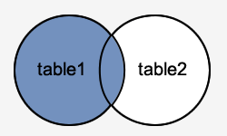

<h1 align="center"> SQL INTRO </h1>

 SQL is a technology used to create and manage databases. SQL works with a type of database called a “relational database”, which are structures of data that have both columns and rows of data Each column in a table stores information about a category of data, such as a name or an email address. A row stores values for a particular entry. So, one row in a database could store a single user’s name and email address.

> ## **Syntax**

All the SQL statements start with any of the keywords like SELECT, INSERT, UPDATE, DELETE, ALTER, DROP, CREATE, USE, SHOW, and all the statements end with a semicolon (;).

>### *SQL SELECT Command example: SELECT A,B,C...,FROM table_name,WHERE condition;**

---

>## [Data Types](#data-types-)

- [Binary](#binary-)
- [Varbinary](#varbinary-)
- [Numeric](#numeric-)
  - [Exact Numeric](#exact-numeric-)
  - [Approximate Numeric](#approximate-numeric-)
- [Character String](#character-string-)
   - [Char Versus](#char-versus-)
   - [Varchar Versus](#varchar-versus-)
- [Date and Time](#date-and-time-)

---

>## [KEYS](#keys-)

- [Super Key](#super-key-)
- [primary Key](#primary-key-)
- [Candidate Key](#composite-key-)
- [Alternate Key](#alternate-key-)
- [Foregin Key](#foreign-key-)
- [Composite Key](#composite-key-)
- [Compound Key](#compound-key-)
- [Surrogate Key](#surrogate-key)

---

>## [Types of SQL Commands](#types-of-sql-commands)

- [DML](#dml)
  - [**SELECT** **:**](#select-)
  - [**INSERT** **:**](#insert-)
  - [**UPDATE** **:**](#update-)
  - [**DELETE** **:**](#delete-)
- [DDL](#ddl)
  - [**CREATE** **:**](#create-)
  - [**ALTER** **:**](#alter-)
  - [**DROP** **:**](#drop-)
  - [**TRUNCATE** **:**](#truncate-)

- [DCL](#dcl)
  - [**GRANT** **:**](#grant-)
  - [**REVOKE** **:**](#revoke-)
- [TCL](#some-commands-in-tcl)
  - [**COMMIT** **:**](#commit-)
  - [**ROLLBACK** **:**](#rollback-)
  - [**SAVEPOINT** **:**](#savepoint-)

---

>## [SQL JOINS](#sql-joins-)
   - [INNER JOIN](#inner-join-)
   - [LEFT OUTER JOIN](#left-outer-join-)
   - [RIGHT OUTER JOIN](#right-outer-join-)
   - [FULL OUTER JOIN](#full-outer-join-)

---
>## [Aggregate functions](#aggregate-functions-)
   - [Count](#count-)
   - [Sum](#sum-)
   - [Avg](#avg-)
   - [Min](#min-)
   - [Max](#max-)

>## **DATA TYPES** **:**
   SQL Data Type is an attribute that specifies the type of data of any object. Each column, variable and expression has a related data type in SQL. You can use these data types while creating your tables. You can choose a data type for a table column based on your requirement.
## **Binary** **:**
   A fixed-width string of length bytes, where the number of bytes is declared as an optional specifier to the type. If length is omitted, the default is 1. Where necessary, values are right-extended to the full width of the column with the zero byte.
## Syntax :

>#### SELECT TO_HEX('ab'::BINARY(4)); 

## **VarBinary** **:**
   A variable-width string up to a length of max-length bytes, where the maximum number of bytes is declared as an optional specifier to the type. The default is the default attribute size, which is 80, and the maximum length is 65000 bytes. VARBINARY values are not extended to the full width of the column.
## Syntax :
>#### SELECT TO_HEX('ab'::VARBINARY(4)); 

## **Numeric** **:**
   Numeric data types are numbers stored in database columns. These data types are typically grouped by:
   ## **Exact Numeric** **:**
   Exact numeric types, values where the precision and scale need to be preserved. The exact numeric types are INTEGER, BIGINT, DECIMAL, NUMERIC, NUMBER, and MONEY.
   ## **Approximate Numeric** **:**
   Approximate numeric types, values where the precision needs to be preserved and the scale can be floating. The approximate numeric types are DOUBLE PRECISION, FLOAT, and REAL.
## Syntax for Numeric datatype :
>#### SELECT(FLOAT '123.5')::INT;?column?

## **Character String** **:**
   Stores strings of letters, numbers, and symbols. Data types CHARACTER (CHAR) and CHARACTER VARYING (VARCHAR) are collectively referred to as character string types, and the values of character string types are known as character strings.

   Character data can be stored as fixed-length or variable-length strings. Fixed-length strings are right-extended with spaces on output; variable-length strings are not extended.

   note: 
         String literals in SQL statements must be enclosed in single quotes.
   ## **Char Versus** **:**
   CHAR is conceptually a fixed-length, blank-padded string. Trailing blanks (spaces) are removed on input, and are restored on output. The default length is 1, and the maximum length is 65000 octets (bytes).

   ## **Varchar Versus** **:**
   VARCHAR is a variable-length character data type. The default length is 80, and the maximum length is 65000 octets. For string values longer than 65000, use Long Data Types. Values can include trailing spaces.

## **Date and Time** **:**
   * All have a size of 8 bytes.
   * A date/time value of NULL is smallest relative to all other date/time values,.
   * Vertica uses Julian dates for all date/time calculations, which can correctly predict and calculate any date more recent than 4713 BC to far into the future, based on the assumption that the average length of the year is 365.2425 days.
   * All the date/time data types accept the special literal value NOW to specify the current date and time. 
   ## Syntax :
   >#### SELECT TIMESTAMP 'NOW'; ?column?

----

>## **KEYS** **:** ##

   KEYS in DBMS is an attribute or set of attributes which helps you to identify a row(tuple) in a relation(table). They allow you to find the relation between two tables. Keys help you uniquely identify a row in a table by a combination of one or more columns in that table. Key is also helpful for finding unique record or row from the table. Database key is also helpful for finding unique record or row from the table.

## **Super Key** **:** ##

   A super key is a group of single or multiple keys which identifies rows in a table.

## **Primary Key** **:**

   Primary Key is a column or group of columns in a table that uniquely identify every row in that table.

## **Candidate Key** **:**

   Candidate Key is a set of attributes that uniquely identify tuples in a table. Candidate Key is a super key with no repeated attributes.

## **Alternate Key** **:**

   Alternate Key is a column or group of columns in a table that uniquely identify every row in that table

## **Foreign Key** **:**

   Foreign Key is a column that creates a relationship between two tables. The purpose of Foreign keys is to maintain data integrity and allow navigation between two different instances of an entity.

## **Compound Key** **:**

   Compound Key has two or more attributes that allow you to uniquely recognize a specific record. It is possible that each column may not be unique by itself within the database.

## **Composite Key** **:**

   Composite Key is a combination of two or more columns that uniquely identify rows in a table. The combination of columns guarantees uniqueness, though individual uniqueness is not guaranteed.

## **Surrogate Key**

   Surrogate Key An artificial key which aims to uniquely identify each record is called a surrogate key. These kind of key are unique because they are created when you don’t have any natural primary key.

---

## **Types of SQL Commands** **:**

>## **DML**

   DML is a short name of Data Manipulation Language which deals with data manipulation and includes most common SQL statements such SELECT, INSERT, UPDATE, DELETE, etc, and it is used to store, modify, retrieve, delete and update data in the database.

## Some Commands in DML

---

## **SELECT** **:**

   The select command is used to retrieve data from the database

## Syntax

   >#### SELECT * FROM table_name

## **INSERT** **:**

   Insert command is used to insert data into a table

## Syntax

   >#### INSERT INTO TABLE_NAME  (col1, col2, col3,.... col N)  VALUES (value1, value2, value3, .... valueN); Or INSERT INTO TABLE_NAME VALUES (value1, value2, value3, .... valueN)  

## **UPDATE** **:**

   The update command is used to update existing data within a table

## Syntax

   >#### UPDATE table_name SET [column_name1= value1,...column_nameN = valueN] [WHERE CONDITION]

## **DELETE** **:**

   Delete command is used to deletes all records from a table, space for the records remain

## Syntax

   >#### DELETE FROM table_name [WHERE condition]

---

>## **DDL**

   DDL is a short name of Data Definition Language, which deals with database schemas and descriptions, of how the data should reside in the database.

## Some Commands in DDL

---

## **CREATE** **:**

   CREATE command is used to create objects in the database

## Syntax

   >#### CREATE TABLE TABLE_NAME (COLUMN_NAME DATATYPES[,....])

## **ALTER** **:**

   ALTER command is used to alter the structure of the database

## Syntax

   >#### ALTER TABLE table_name ADD column_name COLUMN-definition;  ALTER TABLE MODIFY(COLUMN DEFINITION....)

## **DROP** **:**

   DROP command is used to delete objects from the database

## Syntax

   >#### DROP TABLE

## **TRUNCATE** **:**

   This command used to delete all the rows from the table and free the space containing the table.

## Syntax

   >#### TRUNACATE TABLE table_name

 ---

>## **DCL**

   DCL is a short name for Data Control Language which includes commands such as GRANT and is mostly concerned with rights, permissions, and other controls of the database system.

## Some Commands in DCL

---

## **GRANT** **:**

   GRANT command is used to allow specified users to perform specified tasks.
   ## Syntax 
   >#### GRANT CREATE TABLE TO Student;

## **REVOKE** **:**

   REVOKE command is used to cancel previously granted or denied permissions.
   ## Syntax
   >#### REVOKE SELECT ON Student FROM user1
---

>## **TCL**

## Some Commands in TCL

---

## **COMMIT** **:**

   COMMITcommand is used to Commit command is used to permanently save any transaction into the database.
   ## Syntax
   >#### COMMIT;

## **ROLLBACK** **:**

   ROLLBACK command is used to This command restores the database to the last committed state and It is also used with the savepoint command to jump to a save point in a transaction.
   ## Syntax
   >#### ROLLBACK;

## **SAVEPOINT** **:**

   SAVEPOINTcommand is used to Savepoint command is used to temporarily save a transaction so that you can roll back to that point whenever necessary.
   ## Syntax
   >#### SAVEPOINT SAVEPOINT_NAME;
---
>## **SQL JOINS** **:**
 SQL JOINS are used to retrieve data from multiple tables. A SQL JOIN is performed whenever two or more tables are listed in a SQL statement.
## **INNER JOIN** **:**

## Syntax
>##### SELECT columns FROM table1 INNER JOIN table2 ON table1.column = table2.column;
## Visual IIIusration 
       In this visual diagram, the SQL INNER JOIN returns the shaded area:
   

## **LEFT OUTER JOIN** **:**
   This type of join returns all rows from the LEFT-hand table specified in the ON condition and only those rows from the other table where the joined fields are equal (join condition is met). and sometimes called LEFT JOIN.
   ## Syntax :
   >#### SELECT columns FROM table1 LEFT [OUTER] JOIN table2 ON table1.column = table2.column;
   ## Visual IIIustration
         In this visual diagram, the SQL LEFT OUTER JOIN returns the shaded area:
   

## **RIGHT OUTER JOIN** **:**
   This type of join returns all rows from the RIGHT-hand table specified in the ON condition and only those rows from the other table where the joined fields are equal (join condition is met).sometimes called RIGHT JOIN.
   ## Syntax :
   >##### SELECT columns FROM table1 RIGHT [OUTER] JOIN table2 ON table1.column = table2.column;
   ## Visual IIIustration
         In this visual diagram, the SQL RIGHT OUTER JOIN returns the shaded area:
   

## **FULL OUTER JOIN** **:**
   This type of join returns all rows from the LEFT-hand table and RIGHT-hand table with NULL values in place where the join condition is not met.sometimes called FULL JOIN.
   ## Syntax :
   >#### SELECT columns FROM table1 FULL [OUTER] JOIN table2 ON table1.column = table2.column;
   ## Visual IIIustration 
         In this visual diagram, the SQL FULL OUTER JOIN returns the shaded area:
   

---
>## **Aggregate functions** **:**
   An aggregate function allows you to perform a calculation on a set of values to return a single scalar value. We often use aggregate functions with the GROUP BY and HAVING clauses of the SELECT statement.
   ## Syntax
   >#### aggregate_function (DISTINCT | ALL expression)
## **Count** **:**
   counts rows in a specified table or view.
   ## Example :
         To get the number of products in the products table, you use the COUNT function
   >#### SELECT COUNT(*) FROM products;

## **SUM** **:**
   calculates the sum of values.
   ## Example : 
         To calculate the sum of units in stock by product category, you use the SUM function with the  GROUP BY clause 
   >#### SELECT categoryid, SUM(unitsinstock) FROM products GROUP BY categoryid;

## **AVG** **:**
   calculates the average of a set of values.
   ## Example :
         To calculate the average units in stock of the products, you use the AVG function
   >#### SELECT AVG(unitsinstock) FROM products;

## **MIN** **:**
   gets the minimum value in a set of values.

   ## Example :
         o get the minimum units in stock of products in the products table, you use the MIN function.
   >## SELECT MIN(unitsinstock) FROM products;

## **MAX** **:**
   gets the maximum value in a set of values.
   ## Example :
         To get the maximum units in stock of products in the products table, you use the MAX function.
   >#### SELECT MAX(unitsinstock) FROM products;

